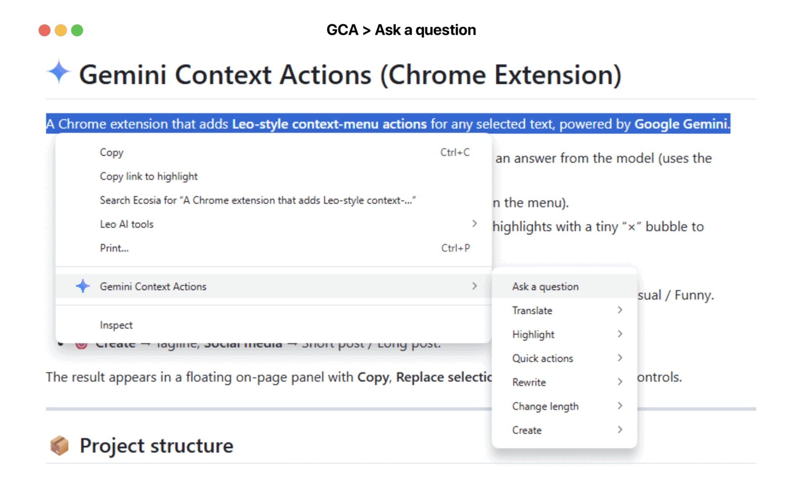
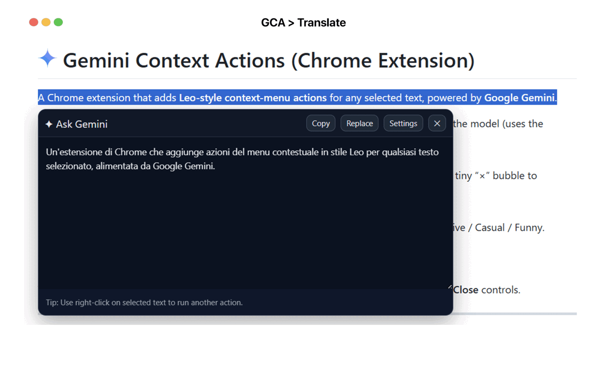
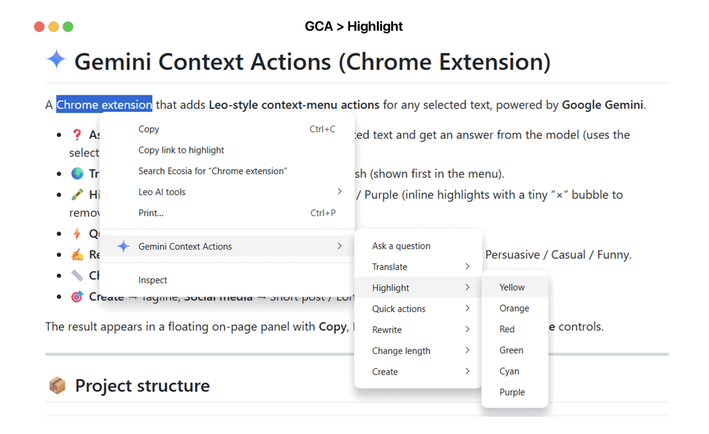

<h1>
  
  Gemini Context Actions (Chrome Extension)
</h1>

A Chrome extension that adds **Leo-style context-menu actions** for any selected text, powered by **Google Gemini**.

* **❓ Ask a question** → type a question about the selected text and get an answer from the model (uses the selection as context).
* **🌍 Translate** → English, French, German, Italian, Spanish (shown first in the menu).
* **🖍️ Highlight** → Yellow / Orange / Red / Green / Cyan / Purple (inline highlights with a tiny “×” bubble to remove).
* **⚡ Quick actions** → Summarize, Explain.
* **✍️ Rewrite** → Paraphrase, Improve, **Change tone** → Academic / Professional / Persuasive / Casual / Funny.
* **📏 Change length** → Shorten, Expand
* **🎯 Create** → Tagline, **Social media** → Short post / Long post.

The result appears in a floating on-page panel with **Copy**, **Replace selection**, **Settings**, and **Close** controls.

---

## 📸 Screenshots

**❓ Ask a question:**  


**🌍 Translate:**  


**🖍️ Highlight:**


---

## 📦 Project structure

```
gemini-context-actions/
├─ manifest.json
├─ background.js
├─ contentScript.js
├─ contentStyles.css
├─ options.html
├─ options.js
└─ icons/
   ├─ icon16.png
   ├─ icon24.png
   ├─ icon32.png
   ├─ icon48.png
   ├─ icon128.png
   └─ icon.svg
```

---

## 🚀 Install (from source)

1. Clone or download this repository.
2. Open **chrome://extensions**.
3. Enable **Developer mode** (top-right).
4. Click **Load unpacked** and select the project folder.

---

## 🔑 Add your Gemini API key

1. In **chrome://extensions**, find **Gemini Context Actions → Details → Extension options**
   (or right-click the toolbar icon → **Options**).
2. Paste your **Google Gemini API key** (from **Google AI Studio**) and click **Save**.
3. Click **Test** to verify the key—if it succeeds, you’re good to go.

> Your key is stored in `chrome.storage.sync` and used only by the background service worker to call the Gemini API over HTTPS.

---

## 🖱️ Use it

1. Select text on any webpage.
2. Right-click to open the context menu.
3. Choose **Translate**, **Quick actions**, **Rewrite**, **Change length**, or **Create**.
4. A floating panel shows the result. Use **Copy** to clipboard or **Replace** to overwrite the current selection.

---

## 🔁 Changing the model (depending on the API you have)

This extension talks to **Google AI Studio’s Generative Language API (REST v1)** by default.
If your key has access to newer or different models, update the constant in **`background.js`**.

### A) You have an **AI Studio (Generative Language API)** key  ✅ (recommended)

* Endpoint (already set in the code):
  `https://generativelanguage.googleapis.com/v1`
* Open **`background.js`** and set:

```js
// background.js
const API_BASE = "https://generativelanguage.googleapis.com/v1";
const MODEL = "gemini-2.5-flash-lite"; // default; change as you like
```

**Common model IDs (as of today):**

* `gemini-2.5-flash-lite` — fastest & cheapest, great for rewrite/translate/summarize.
* `gemini-2.5-flash` — balanced quality/speed.
* `gemini-2.5-pro` — highest quality; slower & pricier.

> Notes:
>
> * Avoid old `-latest` aliases (e.g., `gemini-1.5-flash-latest`) and avoid `v1beta` unless you know you need it.
> * If you switch the default model, you don’t need to change anything else in the extension.

Also update the **Test** button in **`options.js`** if you want it to ping your chosen model:

```js
// options.js (in test() function)
const url = "https://generativelanguage.googleapis.com/v1/models/gemini-2.5-flash-lite:generateContent?key=" + encodeURIComponent(k);
```

### B) You only have a **Vertex AI** key (Google Cloud) ⚠️

Vertex AI uses **different auth (OAuth/Service Account)** and **different endpoints**. Browsers can’t safely sign these requests directly (no secret storage / CORS).
If you must use Vertex AI, set up a minimal **proxy** (Cloud Run/Functions) that:

* accepts `{ model, contents }` from the extension,
* calls Vertex AI server-to-server with your service account,
* returns the generated text.

Then, in **`background.js`**, point `API_BASE` to your proxy instead of Google:

```js
// background.js (if using your proxy)
const API_BASE = "https://your-proxy.example.com"; // your HTTPS proxy
const MODEL = "google/gemini-2.5-flash"; // Vertex model name (your proxy maps it)
```

> If you don’t want to run a proxy, use an **AI Studio** key instead. That’s the path this extension supports out of the box.

---

## 🛡️ Permissions

* `contextMenus` — add the right-click menu.
* `activeTab`, `scripting` — communicate with the current page (to render results / replace text).
* `storage` — store your API key.
* `host_permissions` for `https://generativelanguage.googleapis.com/*` — talk to the Gemini API.

---

## 🔒 Privacy & security

* Your API key is saved via `chrome.storage.sync` and never injected into the web page.
* Requests are performed in the **background service worker**.
* No analytics or third-party calls besides the Gemini API.

---

## 🛠️ Troubleshooting

* **404 NOT_FOUND** with `-latest` models
  Use the **v1** endpoint and a concrete model ID (e.g., `gemini-2.5-flash-lite`, `gemini-2.5-flash`, `gemini-2.5-pro`).
* **“API key required”** in the floating panel
  Open Options and save your key.
* Still stuck? Check **chrome://extensions → Service Worker** console for the extension.

---

## 🧑‍💻 Development

* Edit code → **chrome://extensions → Reload** to pick up changes.
* The floating panel’s look & feel is in **`contentStyles.css`**.

---

## 📄 License

**Copyright © 2025 Vittorio Pio Remigio Cozzoli**.
This project is **licensed under the MIT License**. You are free to use, copy, modify, merge, publish, distribute, sublicense, and/or sell copies of the software under the terms of the MIT license.

See the full text in [LICENSE](LICENSE) file included in this repository.

---